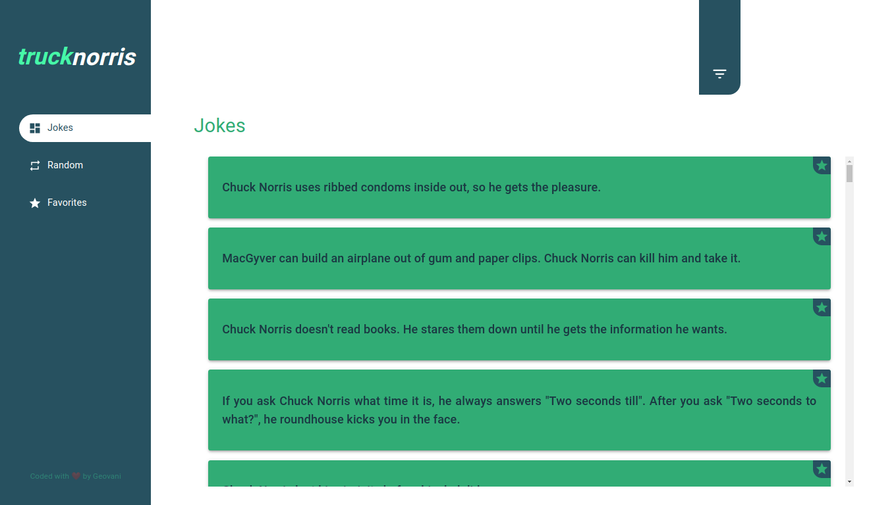

# Truck Norris :black_joker:
 > Projeto web desenvolvido para o challenge da TruckPag

<div align="center">
  <a href="https://truck-norris.geovani.dev.br">
    
  </a>
</div>

<div align="center">
  <a href="https://truck-norris.geovani.dev.br">
    
  </a>
</div>

## Instalação :sparkles:
> Você precisa ter instalado em sua máquina o [Git](https://git-scm.com) e o [Yarn](https://yarnpkg.com/)
1. Clone este repositório
```bash
$ git clone https://github.com/GeovaniJose/truck-norris
```

2. Entre na pasta do repositório
```bash
$ cd truck-norris
```

3. Rode o comando para instalar as dependências
```bash
$ yarn
```

## Como rodar :heavy_check_mark:
> Passo a passo para rodar a aplicação
1. Rode o comando para iniciar a aplicação
```bash
$ yarn start
```

## Tecnologias :wrench:
> Tecnologias usadas no desenvolvimento do projeto:
- ReactJS
- Material-UI
- TypeScript
- Yarn
- LocalStorage
- react-router-dom
- ContextAPI
- react-window
- react-virtualized-auto-sizer
- Responsive layout

## License :page_facing_up:
[MIT License](LICENSE)
